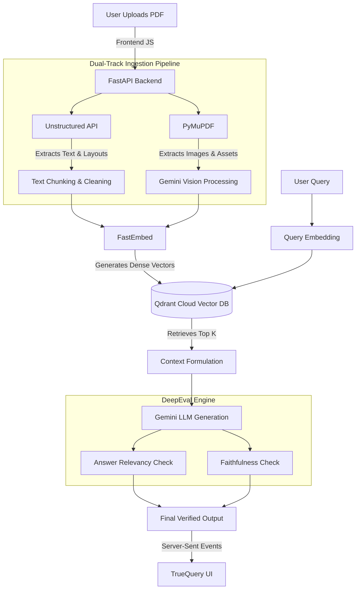

# TrueQuery: Multimodal CRAG Engine 🚀


TrueQuery is an advanced, production-ready **Multimodal Corrective Retrieval-Augmented Generation (CRAG) Engine**. It is designed to ingest complex, unstructured documents (including PDFs with heavy visual assets, tables, and nested layouts), embed them into a high-performance vector database, and generate highly accurate, hallucination-free answers evaluated by real-time metrics.

---

## 🏗️ System Architecture



---

## 🌟 Core Features & Micro-Details

### 1. Dual-Track Document Parsing
Standard RAG systems fail on complex PDFs because they blindly strip text. TrueQuery uses a dual-track approach:
- **Text & Topology (Unstructured API):** Identifies headers, footers, tables, and lists. It preserves the semantic structure of the document so the LLM understands the layout hierarchy.
- **Visual Assets (PyMuPDF + Vision):** Extracts charts, graphs, and images embedded in the PDF, processes them through a Vision LLM to generate dense descriptive summaries, and injects them alongside the text.

### 2. High-Performance Retrieval
- **Vector Database:** Uses **Qdrant Cloud** for lightning-fast ANN (Approximate Nearest Neighbor) vector searches.
- **Embeddings:** Powered by **FastEmbed**, which generates high-quality embeddings directly in memory without requiring heavy GPU infrastructure.

### 3. Corrective Generation & Evaluation (CRAG)
- **DeepEval Integration:** Every answer generated by the Gemini LLM is rigorously graded in real-time. DeepEval checks for **Faithfulness** (ensuring the LLM didn't hallucinate facts outside the context) and **Answer Relevancy**. 

### 4. Zero-Friction UI
- **Vanilla JS + CSS Glassmorphism:** A premium, lightweight frontend that doesn't rely on bloated frameworks.
- **Real-Time Streaming:** Uses Fetch Promises and Server-Sent Events (SSE) to stream chunks of the LLM's answer back to the user instantly.

---

## ☁️ CI/CD & AWS Production Deployment

This repository is wired for completely automated, zero-downtime deployments to AWS using GitHub Actions.

### Deployment Workflow (`deploy.yml`)
1. **GitHub-Hosted Runner:** Upon pushing to the `main` branch, a GitHub Runner checks out the code.
2. **Docker Build:** The runner builds a highly optimized `python:3.11-slim` Docker image.
3. **AWS ECR Push:** The image is securely tagged and pushed to an Amazon Elastic Container Registry (ECR).
4. **EC2 SSH Execution:** The pipeline securely SSHs into an AWS EC2 instance (`t3.small`).
5. **Credentials Injection:** Passes IAM credentials via SSH environment variables to allow the EC2 instance to pull the private image.
6. **Container Hot-Swap:** Stops the old container, starts the new one binding to Port 80, and runs an aggressive `docker image prune` to keep the 30GB EBS volume clean.

---

## 🛠️ Environment Setup

To run this locally or on an EC2 instance, you must create a `.env` file in the root directory:

```env
# Google Gemini API Configurations
GOOGLE_API_KEY=your_gemini_key

# Qdrant Cloud Database Clusters
QDRANT_URL=https://your-cluster-url.aws.cloud.qdrant.io
QDRANT_API_KEY=your_qdrant_key

# DeepEval Configuration
DEEPEVAL_TELEMETRY=0
COHERE_API_KEY=your_cohere_key

# Unstructured API
UNSTRUCTURED_API_KEY=your_unstructured_key
UNSTRUCTURED_API_URL=https://api.unstructuredapp.io/general/v0/general
```

---

## 💻 Local Development

1. **Install Dependencies:**
   ```bash
   pip install -r requirements.txt
   ```
2. **Run the Uvicorn Server:**
   ```bash
   uvicorn app.main:app --reload --host 0.0.0.0 --port 8000
   ```
3. Open your browser to `http://localhost:8000`.

*Built with ❤️ by an AI-Augmented Engineer.*
