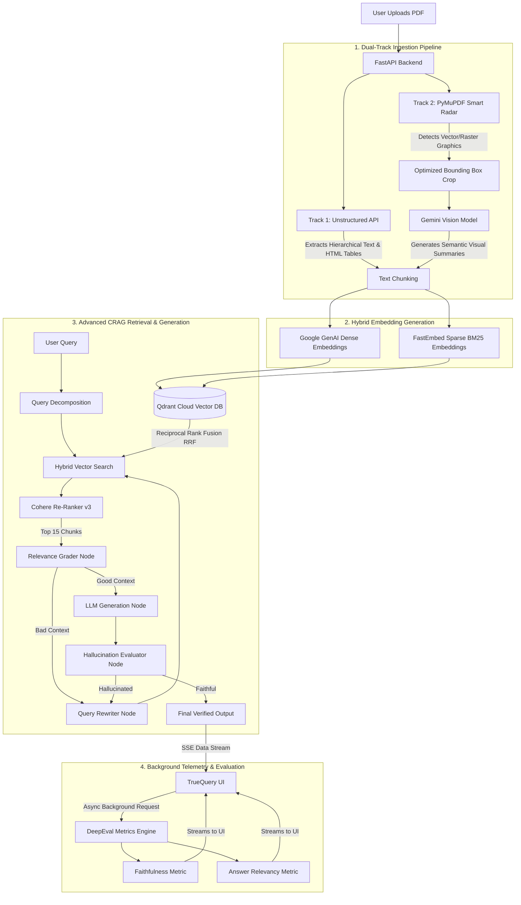

# TrueQuery: Multimodal CRAG Engine 🚀


TrueQuery is an advanced, production-ready **Multimodal Corrective Retrieval-Augmented Generation (CRAG) Engine**. It is engineered to process highly complex unstructured documents, executing a highly-optimized dual-track ingestion pipeline, a hybrid-search retrieval strategy with RRF and Cohere Re-Ranking, and a self-correcting LangGraph agent loop for hallucination-free generation.

---

## 🏗️ System Architecture & Workflow



---

## 🧠 Deep Dive into Core Mechanisms

### 1. Dual-Track Multimodal Parsing
Standard RAG systems fail when parsing visual PDFs. TrueQuery executes a sophisticated dual-track approach:
- **Track 1 (Unstructured API):** Operates on the `hi_res` strategy, preserving the document's topological hierarchy and extracting complex data structures (like HTML tables) seamlessly.
- **Track 2 (PyMuPDF Smart Radar):** Iterates over every page to detect embedded vector drawings and raster images. Instead of blindly passing whole pages to a Vision API, it computes an optimized bounding box around localized visual assets, crops the image, and passes it to **Gemini Vision (3.5 Flash-Lite)**. This generates a rich semantic description of the visuals, which is embedded directly into the database context alongside the text.

### 2. Hybrid Search Engine (Dense + Sparse)
TrueQuery implements true Hybrid Search in **Qdrant**:
- **Dense Vectors (Semantic Context):** Generated using `GoogleGenerativeAIEmbeddings` (3072 dimensions) to capture deep semantic meaning.
- **Sparse Vectors (Keyword Precision):** Generated using `FastEmbed (Qdrant/bm25)` to ensure critical keywords, acronyms, and part numbers are perfectly matched.
- **Reciprocal Rank Fusion (RRF):** Qdrant dynamically fuses the dense and sparse search results at query time, drastically reducing search starvation.

### 3. Cohere Re-Ranking
Hybrid search retrieves the top 20 documents, which are then passed to the **Cohere Re-Ranker (`rerank-english-v3.0`)**. The re-ranker evaluates the semantic relationship of each document against the original user query and re-sorts them, dropping irrelevant chunks and keeping only the absolute best `Top 15` for generation.

### 4. CRAG (Corrective RAG) LangGraph Workflow
The query doesn't just hit the database and return. It enters a rigorous LangGraph state machine:
- **Query Decomposition:** Complex multi-part user queries are split into single-topic sub-queries by an LLM before hitting the database.
- **Relevance Grader:** Checks if the retrieved documents actually contain the raw data needed to answer the question. If they don't, the query is routed to a **Rewriter**.
- **Elite Extraction Protocol:** Once good context is found, the Generator executes strict instructions to synthesize data, handle precision comparisons, and avoid hallucination.
- **Hallucination Evaluator:** A final safety check assesses whether the generated output is faithful to the context chunks. If hallucination is detected, the query is rewritten and the loop restarts.

---

## ☁️ AWS CI/CD Production Deployment

This repository features a fully automated, zero-downtime deployment pipeline to AWS via GitHub Actions.

1. **Dockerized Environment:** The backend is encapsulated in an optimized `python:3.11-slim` image.
2. **AWS ECR Pipeline:** On every commit to `main`, GitHub Actions builds the image and pushes it to Amazon ECR.
3. **Secure SSH Injection:** The pipeline connects to a production EC2 instance (`t3.small`) and securely injects IAM credentials via SSH environment variables.
4. **Hot Swapping:** The EC2 instance automatically pulls the `latest` image, swaps out the running container on Port 80, and aggressively prunes unused images to maintain disk hygiene on the 30GB EBS volume.

---

## 🛠️ Local Development Setup

To run this locally, you must create a `.env` file in the root directory:

```env
# Google Gemini API Configurations
GOOGLE_API_KEY=your_gemini_key

# Qdrant Cloud Database Clusters
QDRANT_URL=https://your-cluster-url.aws.cloud.qdrant.io
QDRANT_API_KEY=your_qdrant_key

# DeepEval Configuration
DEEPEVAL_TELEMETRY=0
COHERE_API_KEY=your_cohere_key

# Unstructured API
UNSTRUCTURED_API_KEY=your_unstructured_key
UNSTRUCTURED_API_URL=https://api.unstructuredapp.io/general/v0/general
```

1. **Install Dependencies:**
   ```bash
   pip install -r requirements.txt
   ```
2. **Run the Uvicorn Server:**
   ```bash
   uvicorn app.main:app --reload --host 0.0.0.0 --port 8000
   ```
3. Open your browser to `http://localhost:8000`.

*Architected & Built by an AI-Augmented Engineer.*
